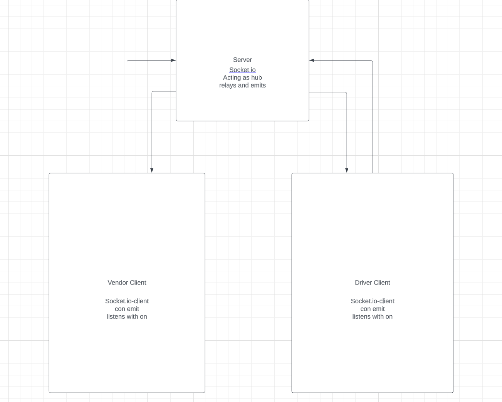

# caps

## Problem Domain

In Phase 2, we’ll be changing the underlying networking implementation of our CAPS system from using node events to using a library called Socket.io so that clients can communicate over a network. Socket.io manages the connection pool for us, making broadcasting much easier to operate, and works well both on the terminal (between servers) and with web clients.

The core functionality we’ve already built remains the same. The difference in this phase is that we’ll be creating a networking layer. As such, the user stories that speak to application functionality remain unchanged, but our developer story changes to reflect the work needed for refactoring.

User Stories:

- As a vendor, I want to alert the system when I have a package to be picked up.
- As a driver, I want to be notified when there is a package to be delivered.
- As a driver, I want to alert the system when I have picked up a package and it is in transit.
- As a driver, I want to alert the system when a package has been delivered.
- As a vendor, I want to be notified when my package has been delivered.

## Process

- Create a repo
- Clone repo
- npm i chance dotenv eslint jest socket.io socket.io-client
- Structure folders so that server vendor and driver all run independently
- Code
- Test

## UML

## Tools

- Chat GPT any time I am stuck(for guidance not answers)

## Collaboration

- Solo project but I pick classmates brains throughout all of the lab time
