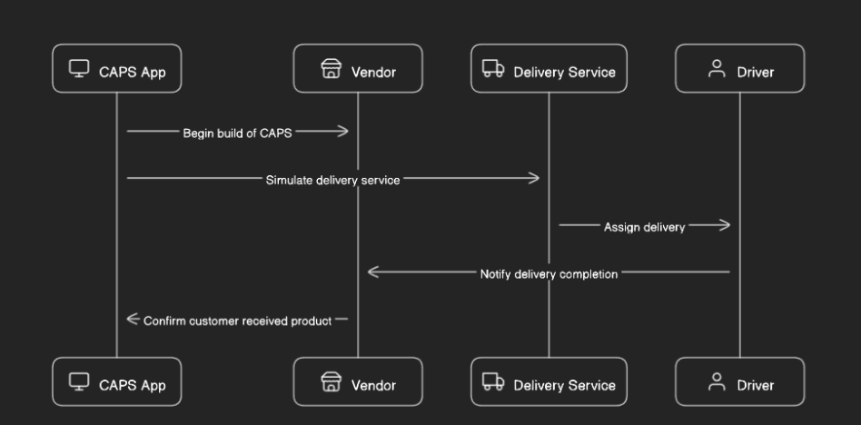

# Caps

## Problem Domain

- CAPS Phase 1: Begin the build of an application for a product called CAPS - The Code Academy Parcel Service. In this sprint, we’ll build out a system that emulates a real world supply chain. CAPS will simulate a delivery service where vendors (such a flower shops) will ship products using our delivery service and when our drivers deliver them, each vendor will be notified that their customers received what they purchased.

## Process

- create repo
- clone repo
- npm i eslint chance jest

## UML

## Tools Used

- Chat GPT to explain to me any spots I was stuck at

## Testing

- Not done yet

## Collab

- Me
